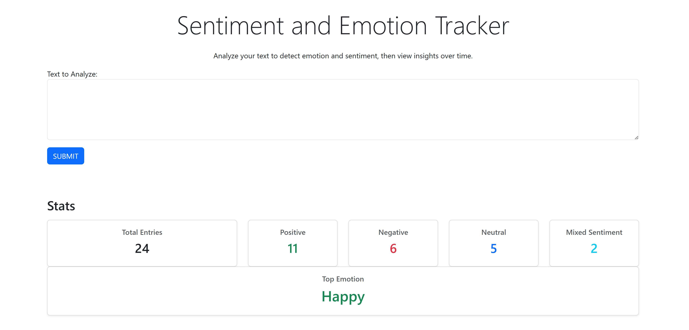
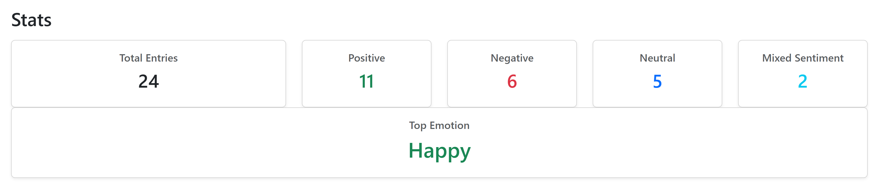
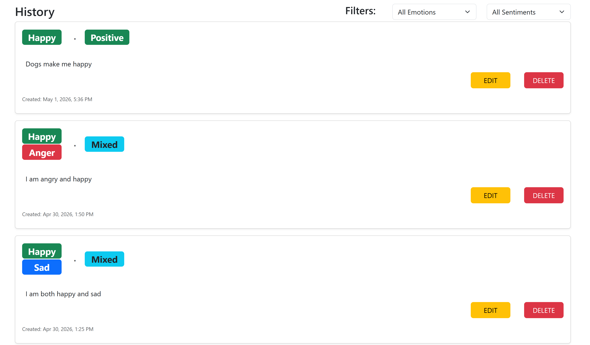
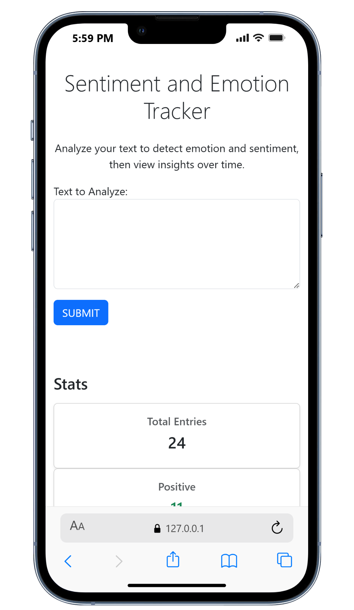
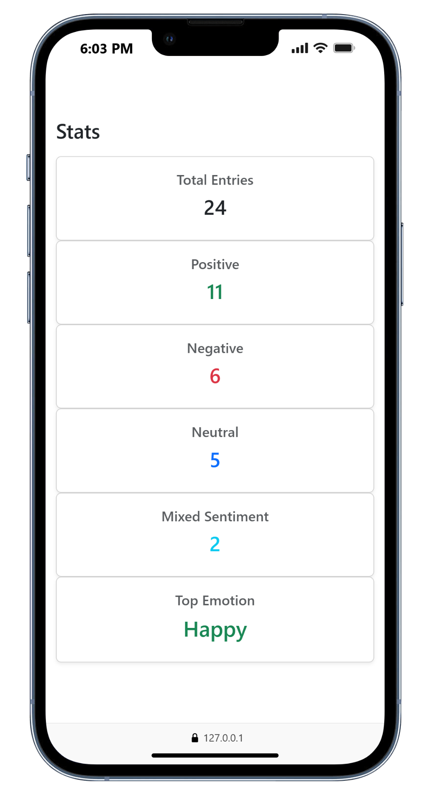
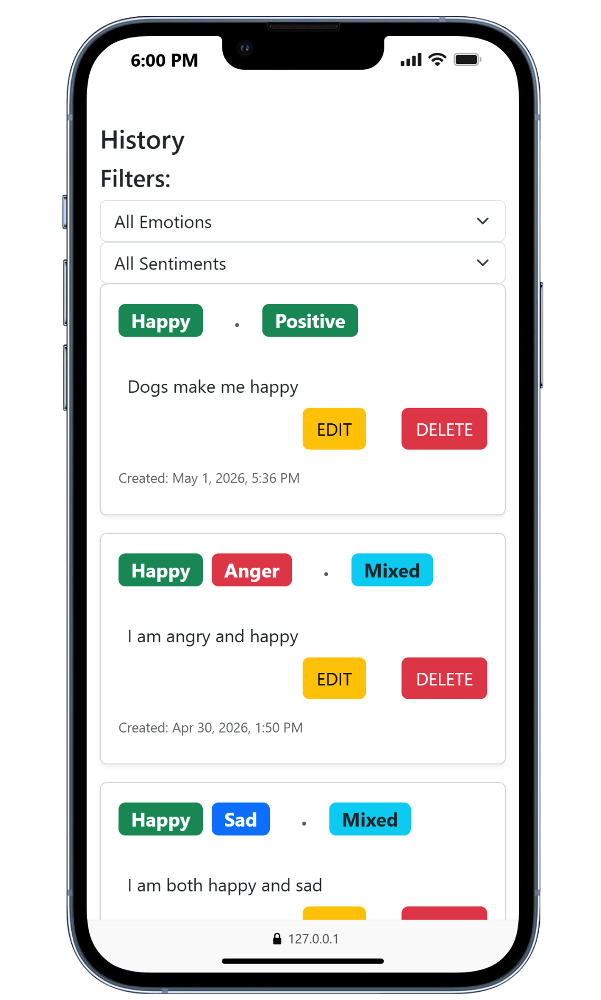

# Emotion Tracker

A full-stack web application that analyzes user text for **emotion** and **sentiment** using NLP, stores entries, and includes a real-time analytics dashboard.

🔗 **Live Demo:** https://emotion-tracker-0ea4.onrender.com

---

## 📸 Screenshots


Explore the application interface across desktop and mobile views.

### 🖥️ Desktop







### 📱 Mobile








---

## 🚀 Features

- 🧠 **Emotion Detection**
  - Detects emotions such as happy, sad, anger, fear, and disgust
  - Supports multiple emotions (ties)

- 💬 **Sentiment Analysis**
  - Classifies text as positive, negative, neutral, or mixed
  - Custom logic improves accuracy for mixed-emotion inputs

- 📊 **Analytics Dashboard**
  - Total entries
  - Sentiment breakdown
  - Top emotion detection (with tie handling)

- 🔍 **Filtering**
  - Filter entries by emotion and/or sentiment

- 📄 **Pagination**
  - Load entries incrementally for better performance

- ✏️ **CRUD Functionality**
  - Create, update, and delete entries

- 📱 **Responsive UI**
  - Works on both desktop and mobile devices

---

## 🛠 Tech Stack

**Backend**
- FastAPI
- SQLModel (SQLite)
- NLTK (VADER + custom emotion logic)

**Frontend**
- HTML, CSS, JavaScript
- Bootstrap

**Deployment**
- Render

---

## 🧠 How It Works

1. User submits text
2. Backend:
   - Analyzes sentiment using VADER
   - Detects emotion using a custom lexicon + lemmatization
   - Applies logic for mixed sentiment
3. Data is stored in the database
4. Frontend dynamically updates:
   - Entry history
   - Stats dashboard

---

## 📌 Key Highlights

- Combined **rule-based NLP + custom logic** for improved sentiment accuracy
- Implemented **multi-label emotion detection**
- Built a **responsive UI** with dynamic rendering
- Designed with **scalability in mind** (pagination, filtering)

---

## ⚠️ Notes

- This demo uses SQLite, which may reset on redeploy (Render free tier)
- Intended as a demonstration project; production version would use a persistent database

---

## 🧪 Run Locally

```bash
git clone https://github.com/wedjasouza/emotion-tracker.git
cd emotion-tracker
pip install -r requirements.txt
uvicorn main:app --reload
```

## 👨‍💻 Author

Wedja Souza  
GitHub: https://github.com/wedjasouza
LinkedIn: https://linkedin.com/in/wedja-souza